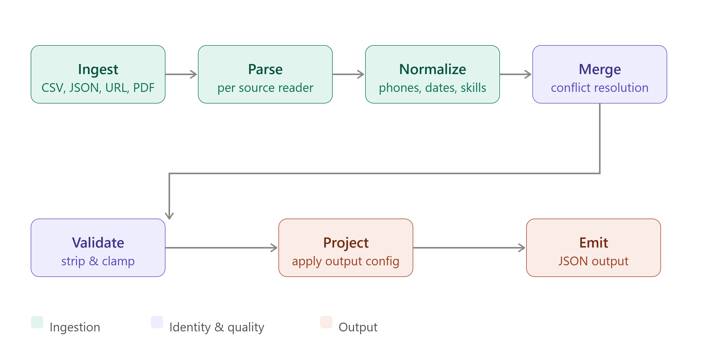

# Multi-Source Candidate Data Transformer

Transforms messy, multi-source candidate data (recruiter CSV exports, ATS JSON
blobs, resumes, free-text recruiter notes, GitHub profiles) into a single
clean, canonical JSON profile per person, with full field-level provenance
and a runtime-configurable output schema.

---

## Contents

- [Project structure](#project-structure)
- [Pipeline overview](#pipeline-overview)
- [Run steps](#run-steps)
- [Produced output](#produced-output)
- [Canonical output schema](#canonical-output-schema)
- [Normalization rules](#normalization-rules)
- [Merge / conflict-resolution policy](#merge--conflict-resolution-policy)
- [Runtime custom-output config](#runtime-custom-output-config)
- [Edge cases handled](#edge-cases-handled)
- [Known issue found & fixed this round](#known-issue-found--fixed-this-round)
- [Tests](#tests)
- [Assumptions](#assumptions)
- [Descoped / left out under time pressure](#descoped--left-out-under-time-pressure)
- [Design decisions](#design-decisions)

---

## Project structure

```
src/main/java/com/eightfold/transformer/
├── Main.java                    -- CLI entry point
├── TransformerPipeline.java    
├── model/
│   └── CandidateProfile.java   -- Canonical data model
├── config/
│   └── OutputConfig.java       -- Runtime config schema
├── parser/
│   ├── RecruiterCsvParser.java
│   ├── AtsJsonParser.java
│   ├── GitHubProfileParser.java
│   ├── ResumeParser.java
│   └── RecruiterNotesParser.java
├── normalizer/
│   ├── PhoneNormalizer.java    -- E.164 conversion
│   └── SkillNormalizer.java    -- Canonical skill names
├── merger/
│   └── ProfileMerger.java      -- Union-Find deduplication
├── output/
│   └── OutputProjector.java    -- Config-driven projection
└── validator/
    └── ProfileValidator.java   -- Schema validation
src/test/java/com/eightfold/transformer/
└── TransformerTest.java        -- Unit + regression tests
sample-inputs/                  -- Example CSV/JSON/TXT + custom_config.json
output.json                     -- Sample default-schema output 
custom_output.json              -- Sample custom-config output 
```

---

## Pipeline overview




Source detection is by file extension, dispatched in `TransformerPipeline.run()`:

| File type          | Source         | Parser                  |
|---------------------|----------------|--------------------------|
| `*.csv`             | Recruiter CSV  | `RecruiterCsvParser`     |
| `*.json`            | ATS JSON blob  | `AtsJsonParser`          |
| `*.pdf` / `*.docx`  | Resume         | `ResumeParser`           |
| `*.txt`             | Recruiter notes| `RecruiterNotesParser`   |
| `github_urls.txt`   | GitHub API     | `GitHubProfileParser`    |

---

## Run steps

### Prerequisites
- Java 17+
- Maven 3.8+

### 1. Clone & build
```bash
git clone <this-repo-url>
cd candidate-transformer
mvn clean package -q
```
This produces `target/candidate-transformer-1.0.0-shaded.jar` (all dependencies bundled).

### 2. Run with the default canonical schema
```bash
java -jar target/candidate-transformer-1.0.0-shaded.jar sample-inputs/
```
Writes `output.json` (default filename) to the current directory, and also prints
the result to stdout.

### 3. Run with a custom runtime output config
```bash
java -jar target/candidate-transformer-1.0.0-shaded.jar sample-inputs/ \
  --config sample-inputs/custom_config.json \
  --output custom_output.json
```

### 4. Run the test suite
```bash
mvn test
```
Surefire reports land in `target/surefire-reports/`.

### CLI reference
```
Usage: java -jar transformer.jar <input-dir> [--config config.json] [--output result.json]

Arguments:
  <input-dir>          Directory containing source files (.csv, .json, .pdf, .docx, .txt)
  --config <file>      Optional runtime output config JSON
  --output <file>      Output file (default: output.json)
```

---

## Produced output

Running step 2/3 above against the bundled `sample-inputs/` (4 real candidates:
Priya Sharma, Vikram Nair, Rahul Mehta, Ananya Singh - corroborated across CSV,
ATS JSON, and free-text notes) produces:

- **`output.json`** -- full canonical schema, 4 candidate records.
- **`custom_output.json`** -- same 4 candidates, reshaped to the projection
  defined in `sample-inputs/custom_config.json`.

Both files are checked into the repo root as a reference so you don't have to
build to see the shape of the output. Re-running the commands above will
regenerate them from scratch.

Example record from `output.json`:
```json
{
  "candidate_id": "email_priya_sharma_example_com",
  "full_name": "Priya Sharma",
  "emails": ["priya.sharma@example.com"],
  "phones": ["+919876543210"],
  "location": { "city": "Bangalore", "region": "Karnataka", "country": "IN" },
  "headline": "Senior Software Engineer",
  "years_experience": 6,
  "skills": [
    { "name": "Java", "confidence": 0.8, "sources": ["ats_json"] }
  ],
  "overall_confidence": 0.82
}
```

---

## Canonical output schema

```json
{
  "candidate_id": "string",
  "full_name": "string",
  "emails": ["string"],
  "phones": ["string (E.164)"],
  "location": { "city": "string", "region": "string", "country": "ISO-3166 alpha-2" },
  "links": { "linkedin": "string", "github": "string", "portfolio": "string", "other": {} },
  "headline": "string",
  "years_experience": "integer",
  "skills": [ { "name": "canonical string", "confidence": "0-1", "sources": ["string"] } ],
  "experience": [ { "company": "string", "title": "string", "start": "YYYY-MM", "end": "YYYY-MM | null", "summary": "string" } ],
  "education": [ { "institution": "string", "degree": "string", "field": "string", "year": "string" } ],
  "provenance": [ { "field": "string | *", "source": "string", "method": "string" } ],
  "overall_confidence": "0-1"
}
```

## Normalization rules

| Field        | Rule                                                                                                  | Implementation        |
|--------------|---------------------------------------------------------------------------------------------------------|------------------------|
| Phones       | Converted to E.164 (`+<country><national>`). 10-digit numbers starting 6-9 are heuristically treated as Indian mobiles; other 10-digit numbers default to US/CA (`+1`). Unrecognizable numbers → `null`/dropped. | `PhoneNormalizer`     |
| Skills       | Mapped through a 70+ entry alias table (`js`→`JavaScript`, `k8s`→`Kubernetes`, `nodejs`/`node.js`→`Node.js`, …). Unknown skills fall back to title-case rather than being dropped. | `SkillNormalizer`     |
| Country      | Free text (`"india"`, `"United States"`, `"uk"`) mapped to ISO-3166 alpha-2 (`IN`, `US`, `GB`); anything else uppercased and later re-validated against `^[A-Z]{2}$` by the validator. | `AtsJsonParser`, `ProfileValidator` |
| Dates        | `YYYY-MM-DD` / `MM/YYYY` / `YYYY` all normalized to `YYYY-MM`; anything else passed through, then rejected by the validator if it doesn't match `^\d{4}-\d{2}$`. | `AtsJsonParser.normaliseDate` |

---

## Merge / conflict-resolution policy

**Identity / match keys**, applied via Union-Find so matches are transitive
(A=B by email, B=C by phone => A=B=C), checked in this priority order:

1. Shared email (case-insensitive, exact).
2. Shared phone (post-normalization).
3. `full_name + location.city`, lower-cased, fuzzy only in the sense of being
   case/whitespace-insensitive - **not** typo-tolerant (see Descoped).

**Conflict resolution, once a group of partial profiles is known to be the
same person:**

- Sort the group by `overall_confidence` descending; the highest-confidence
  profile becomes the **primary** record.
- Scalar fields (`headline`, `location`, individual link fields) are
  **fill-missing only** — the primary's value always wins if it has one;
  a lower-confidence source can only fill a field the primary left blank
  (and that fill is itself recorded in `provenance`).
- List fields (`emails`, `phones`, `skills`, `experience`, `education`) are
  **always unioned**, never dropped, deduplicated by a natural key
  (skill name, `company|title`, institution).
- `years_experience` takes the **max** across sources.
- `overall_confidence` is recomputed as the **weighted average of all
  contributing sources' confidence, plus a +0.05 bonus per extra
  corroborating source** (capped at 1.0) — multi-source agreement is
  rewarded.

**Confidence by source**, assigned at parse time:

| Source           | Confidence | Rationale                                  |
|-------------------|-----------|----------------------------------------------|
| Recruiter CSV     | 0.85      | Structured, direct field mapping             |
| ATS JSON          | 0.80      | Structured, but field names vary by vendor (alias-mapped) |
| Resume (PDF/DOCX) | 0.60      | Heuristic regex/NER extraction               |
| Recruiter notes   | 0.50      | Free text, keyword extraction                |

---

## Runtime custom-output config

Pass `--config <file>` to reshape the canonical profile without touching the
pipeline. Example:
```json
{
  "fields": [
    { "path": "full_name",     "type": "string",   "required": true },
    { "path": "primary_email", "from": "emails[0]","type": "string", "required": true },
    { "path": "phone",         "from": "phones[0]","type": "string", "normalize": "E164" },
    { "path": "skills",        "type": "string[]", "normalize": "canonical" }
  ],
  "include_confidence": true,
  "on_missing": "null"
}
```
- `path` is the key in the output; `from` (optional, defaults to `path`) is a
  dot/bracket source path into the canonical profile (`emails[0]`,
  `location.city`, `skills[0].name`, ...).
- `normalize`: `E164` or `canonical` - re-applies the same normalizers used in
  the main pipeline, so projected output gets the same guarantees.
- `on_missing`: `null` (write JSON `null`, default) | `omit` (drop the key
  entirely) | `error` (throw if a **required** field resolves to nothing).
  Note: `required` is only enforced when `on_missing` is `error` - under
  `null`/`omit` a missing required field is silently written as `null`/omitted,
  which is intentional (lets you preview a projection without it failing on
  partial data) but is documented here since it's easy to assume otherwise.

---

## Edge cases handled

| Edge case | Handling |
|-----------|----------|
| Duplicate CSV rows (same email) | First-write wins; the parser dedups before the row ever reaches merge. |
| Same person across multiple sources (CSV + ATS + notes) | Union-Find merge; list fields unioned, scalar fields fill-missing, confidence rewards corroboration. |
| Conflicting field values across sources | Higher-confidence source's scalar values win; nothing is silently overwritten by a lower-confidence source. |
| Non-E.164 / garbage phone numbers, invalid emails, out-of-range years/confidence | Validator strips or clamps these **after** merge, so a good value from one source can rescue a bad one from another, before anything is removed. |
| Unknown ATS vendor field names | Alias map (50+ mappings) tried in ranked order per field; unmapped fields are simply absent from the canonical profile rather than guessed. |
| Non-candidate JSON in the input folder (e.g. the OutputConfig file) | See [Known issue found & fixed](#known-issue-found--fixed-this-round) below. |
| Empty/blank source files, unknown file extensions | Skipped gracefully (logged), pipeline doesn't crash. |

---

## Known issue found & fixed this round

While reviewing a generated `output.json`, I found a 5th, entirely blank
record (no name, no email, `provenance: ats_json/alias_mapping`) sitting
alongside the 4 real candidates.

**Root cause:** `TransformerPipeline` treats *every* `*.json` file in the
input directory as ATS candidate data. `sample-inputs/custom_config.json` -
which is only meant to be loaded via `--config`, not scanned as input, also
matches that extension. `AtsJsonParser` mapped it anyway: none of its keys
(`fields`, `include_confidence`, ...) matched any candidate alias, so it
silently produced an empty `CandidateProfile`. `ProfileValidator` *did*
correctly flag this with `candidate_id is blank` as an error, but the
pipeline only logged validator errors, it never excluded the record from
the final output.

**Fix (two layers, defense-in-depth):**
1. `AtsJsonParser` now skips any JSON node that maps to zero candidate
   signal (no name/email/phone/headline/skills/experience/education) instead
   of emitting an empty profile.
2. `TransformerPipeline` now actually excludes any record the validator
   flags as invalid (`vr.errors` non-empty) from the output, instead of only
   printing it to the console.

Covered by two new regression tests, see [Tests](#tests).

---

## Tests

```bash
mvn test
```

22 unit/integration tests in `TransformerTest.java`, grouped by component:

- **`PhoneNormalizer`** : US 10-digit, Indian 10-digit, already-E.164,
  too-short rejection, numbers with spaces/dashes.
- **`SkillNormalizer`** : alias resolution (`js`, `nodejs`/`node.js`, `k8s`),
  unknown-skill title-case fallback.
- **`RecruiterNotesParser`** : key/value extraction, graceful handling of
  unstructured text with no recognizable keys.
- **`ResumeParser`** : email/skill extraction from raw resume text.
- **`AtsJsonParser`** : date normalization (`2021-03-15` / `2021` /
  `06/2019` -> `YYYY-MM`).
- **`GitHubProfileParser`** : username extraction from full URLs, bare
  `github.com/...`, and bare usernames.
- **`ProfileMerger`** : dedup by email, keeping distinct candidates separate,
  unioning skills across sources.
- **`ProfileValidator`** : invalid email/phone stripping, confidence
  clamping.
- **Pipeline edge case** : empty input directory produces an empty result
  without crashing.
- **Regression (this round's fix)** : `AtsJsonParser` skips a config-shaped
  JSON file; an end-to-end pipeline run with a real candidate CSV *and* a
  non-candidate JSON config file in the same folder produces exactly 1
  result, not 2.

---

## Assumptions

- Input files for a given run all belong to the **same batch/import**; there's no cross-run identity resolution.
- `full_name + city` matching is a reasonable third-priority identity signal
  for this assignment's data volume; it is **not** safe at large scale where
  name collisions are likely (see Descoped).
- A CSV row, ATS JSON node, or notes file with **no usable candidate field at
  all** is not a candidate and should be excluded from output rather than
  emitted as a blank record (this is the assumption that drove this round's
  bug fix).
- GitHub API calls are unauthenticated by default (60 req/hr); set
  `GITHUB_TOKEN` in the environment to raise the limit, per
  `GitHubProfileParser`.
- "Required" in a custom output config is advisory unless `on_missing` is
  explicitly set to `"error"`,  this lets a config be tested against partial
  data without hard-failing.

## Descoped / left out under time pressure

- **Fuzzy/typo-tolerant name matching** (e.g., Levenshtein/Jaro-Winkler) :
  identity resolution is exact-match (case/whitespace-insensitive) on
  email, phone, or name+city. Two different "Priya Sharma"s in Bangalore
  would incorrectly merge; conversely, "Priya Sharma" vs. "Priya  Sharma "
  with a typo would not.
- **Cross-batch persistence** : no database; every run is stateless and
  independent.
- **GitHub API pagination/retry/backoff** : only the first page of repos is
  fetched, no retry on rate-limit or transient failure.
- **ML-based resume parsing** : regex/heuristic NER only; non-standard resume
  layouts degrade to lower confidence rather than failing outright, but
  won't extract as richly as a templated resume.
- **Schema migrations / versioning** for the canonical or custom output
  formats.
- **Config-file vs. candidate-file disambiguation beyond "does this JSON
  contain any candidate signal"** : a maliciously/accidentally crafted JSON
  file that happens to reuse a candidate alias key (e.g. `{"email": "..."}`)
  in a non-candidate context would still be picked up. A stricter fix (e.g.
  an explicit allow/deny list of input filenames, or excluding the
  `--config` path by canonical file path) was considered but the
  signal-based check was chosen as the more general guard against *any*
  stray/junk JSON, not just this one file.

---


## Design decisions

**Why union-find for merging?** It's effectively O(n) and naturally handles
transitive identity (A=B by email, B=C by phone => A=B=C) without a separate
graph library.

**Why confidence scores?** Every field is traceable to a source. Downstream
ML systems can weight structured sources (CSV = 0.85) over free-text
(notes = 0.50) rather than treating all input as equally trustworthy.

**Why alias maps over ML-based field extraction?** Deterministic, explainable,
zero latency, and correct 100% of the time for known vendors. Unknown fields
degrade to `null`, never invented.

**Why validate after merge, not before?** To benefit from cross-source
correction (e.g., ATS JSON has a valid phone, notes had a bad format) before
removing data and, as this round's bug fix reinforced, validation is also
the last line of defense against bad records reaching output at all, so its
result now has to actually gate the output rather than just being logged.

[def]: image-1.png